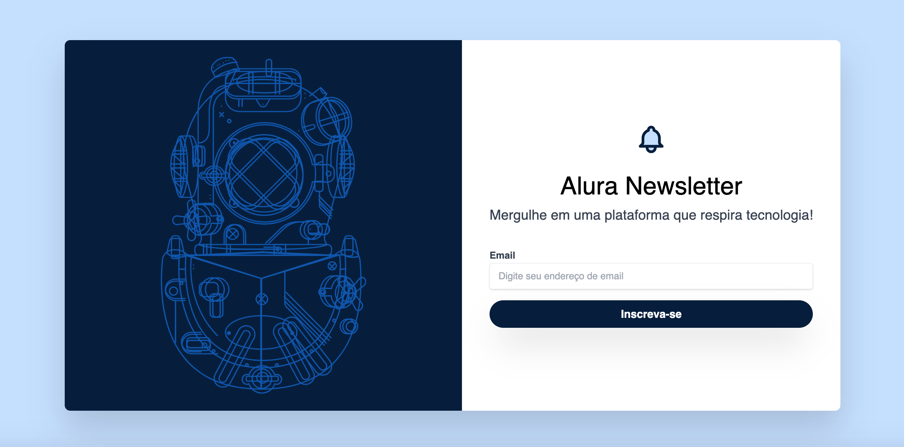

<h1 align="center">:newspaper_roll: Newsletter Alura </h1>

  

<h2>Aula do curso <b>Tailwind CSS: estilizando a sua página com classes utilitárias</b> da Alura. :ocean:</h2>

 <h2>Alguns temas abordados em aula: </h2>
<ul>
<li>Identificar quais as principais diferenças entre o Bootstrap e o Tailwind CSS </li>
<li>Implementar customizações em seu projeto com o tailwind.config </li>
<li>Modificar o alinhamento e posicionamento dos elementos </li>
<li>Experimentar estilizar elementos com o uso das classes utilitárias </li>
<li>Produzir uma animação do zero para a Alura Newsletter </li>
</ul>

---

## 🚀 Tecnologias

Esse projeto foi desenvolvido com as seguintes tecnologias:

- HTML
- Tailwind CSS
- GIT
- GitHub

---

<h2 align="center"> feito com 💖 por Yasmin. </h2>
